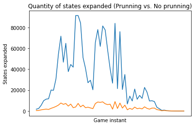

# Solution description

When playing Othello, the following components are considered:
* There are 2 players → the black and wite tiles.
* An initial Board (8x8) where 4 tiles are positioned: 2 for each color.

The player with the black tiles is the one who starts the game. Othello consists of positioning new tiles, these tiles need to flank your opposite's tiles. To accomplishing that you have a maximum of 8 movements which are:
-   Right
-   Left
-   Up
-   Down
-   Up to the Right
-   Up to the Left
-   Down to the Right
-   Down to the Left

If the player wants to positionante a tile, the flank rule must be considered. You can't positionate your tile wherever you want. So the players have to play smart and positionate the tile where they can flank more opposite positions.<br>
The game is over when there are no more possible empty spaces to position a tile or when there are empty spaces but no possible flank tiles. 

We want to program an intelligent game where the computer is able to find the best position to flank more tiles. 
In this case, given that we have 2 players,  we will follow the Adversarial search techniques:

- Initial State: As it was mentioned before, the initial state consists of a board with 4 tiles. 
- Final State: The final state is the board where there are no empty spaces or possible flank tiles. 
- Players: The two players are the human (or computer) and the computer.
- Actions: As it was indicated, depending on the tile you are considering, the player has a maximum of 8 possible positions. 
- Result: Giving the board, the position and the player, the result will be the board where the tile is positioned and the corresponding tile(s) was/were flanked.
- Utility: Given a final state, the utility function calculated a valyue to express if the player wins or loses. 
- Terminal Test: It determines if the game is over. 

## Understanding our board

The implemented board is represented by an [8x8] matrix. For the interface, columns go from A to H from left to right and rows go from 1 to 8 from top to bottom. Internally, rows and columns go from 0 to 7 respectively. 

Each empty position is symbolized by a 0, 1 represents a Black tile and -1 represents a White tile.

As required, the program has been evaluted with these heuristics functions
-   Heuristic 
    ```
    def otello_heuristic_count_tiles(state:ndarray,color):
        return state.sum()
    ```
    
    In this heuristic we calculate the sum of the board. If there are more Black than White tiles, the result will be a positive number and it will increase as the presence of black tiles increases. On the other hand, the result will be a negative number when there are more White tiles. 
    This heuristic represents the advantage you have, considering the difference between the positioned tiles. It will help the program to know when the board is on your favor, it means that there are more tiles of your color. 

-   Heuristic 2
    ```
    def otello_heuristic_possible_actions(state:ndarray, color: int):
        actions = otello_actions(state,color)
        quantity_of_actions = len(actions) * color
        return quantity_of_actions
    ```
    This heuristic returns the quantity of possible actions given a board. The player will receive this quantity according to the respective sign → Possitive for Blacks and Negative for Whites. 
    This represents the options the player has to flank one or various tiles. 

-   Heuristic 3
    ```
    def otello_compose_heuristic(state:ndarray, color):
        return otello_heuristic_count_tiles() + otello_heuristic_possible_actions(state, color)
    ```
    The third proposed heuristic is a combination of the previos heuristics. It returns the sum of the board and the quantity of actions given a state. With this value the player will know how convenient is that state given that two values are considered. 
    

# Experiments and Conclussions

## Heuristic

The experiments for every heuristic function is in heuristics_analysis.ipynb<br>
We have chosen the First Heuristic, because it is the one with the best behavior. It takes the algorithm a considered quantity of rounds to find a winner, it is not that easy to win. 

Experiments in ```heuristics_analysis.ipynb```

## Depth

Hence we are working with the ```MinMaxAlphaBetaWithDepth``` algorithm, we won't expand the whole game three, that's why the heuristics  represent an approach to the utility value and these will be used when the depth is reached. Even though, we are also considering the utility value because there may be a case when the depth value represents the final state. That might happen specially when the board is almost full and there are no a lot of possible actions. 

Added to the previous behavior, ```MinMaxAlphaBetaWithDepth``` works with a Cut-Off point to avoid expand the whole game three. The algorithm has been run with differents ```depth``` values: 4, 5

The depth value will help us to determine how many future states will be expanded. After evaluating those values, considering the efficiency of the program, we have found that 4 represents the best value, specially because the average run time is less than 10 seconds (3.67 s.) to find the best action.

The final decission was 4, because although a cut off level of 5 bring the algorithm more information for a best decssion, with othello logic loop impletation the performance took more time than 10 s. Even reach 70.62 s. to get the best action. But was invencible.

We tried to use a level of 5 improving the othello logic impletation changing loops for numpy array operations. But this logic was too complex and presents some problems, although it was definitely more faster than the original. That implementation coul be found in the branch ```npOptimization```.

Experiments in ```heuristics_analysis.ipynb```

## Prunning vs No prunning

Alpha-Beta prunning is an other algorithm that helps us to get an efficient behavior, because we will prune the unnecesary states. When this optimization is applied the algorithm does expand a lot of values, but when the algorithm does not prune, the expanded states increase in a big way. It is also notable that the program is not as efficient as it was, it takes more time to accomplish the final state.

The previous conclussion could be proved by the number of states that each algorithm expand to find the best action. In the follow graphic could be clearly appreciated that when the algorithm doesn't prune the tree, expands more states needlessly (because both find the same best action).



Experiments in ```prunning_analysis```